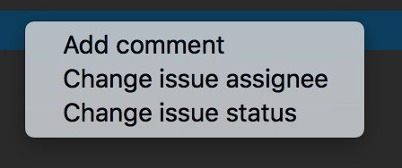
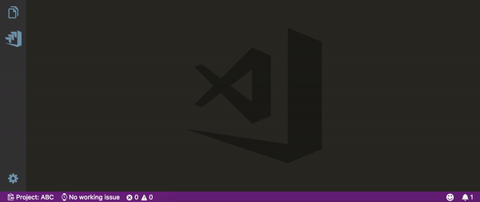

# jira-plugin README

 Inspired by [vscode-jira](https://github.com/KnisterPeter/vscode-jira) I decided to create my own JIRA plugin for VS Code. 
I'm happy to will implement more features. :blush:   

## Install

ext install jira-plugin  

## Usage

From the command palette Ctrl-Shift-P (Windows, Linux) or Cmd-Shift-P (OSX) under **Jira-plugin** you have all the extension commands.  

## Setup

First of all your have to launch "Setup credentials" command to configure the plugin. 
The Jira base URL is needed and also your credentials. 

## Set working project

After setup you have to set the working project, you can click on status-bar icon or use "Set working project" command.  
**n.b:** If you need to browse issues for various project you have to switch the working project. 

## Config

The extension store credentials in VS Code settings.  
**n.b:** the extension store the password in VS Code internal storage so it's safe and hidden. :wink:  

## Explorer Features

- **All issues** 
  With this command you can search all issues for the current project.  
- **Issue by id** 
  With this command you can search an issue by id.  
- **Issues filtered by status** 
  With this command you can search issues with a particular status.  
- **Issues filtered by status and assignee** 
  With this command you can search issues with a particular assignee and status.  
- **Issues filtered by summary** 
  With this command you can search issues with a particular summary.  
- **My issues filtered by status** 
  With this command you can search your issues with a particular status.  

## Item Features (right click on item)

- **Add comment** 
  With this command you can add comment. [@] is the placeholder for tag a user. **e.g:** 'This is the placeholder for tag user -> [@]'  
- **Change issue assignee** 
  With this command you can change an issue assignee.  
- **Change issue status** 
  With this command you can change an issue status.  

## Explorer

- In the explorer you can use all the extension command

## Status bar

### Working project

- The extension in the status bar show the **working project**, you can also change it from here.

### Working issue

- The extension in the status bar show the **working issue**, you can also change it from here.  
  You can choose working issue from your **In Progress** issues.  
  The extension trace the time spended on the working issue and you can also create the Jira worklog for the activity.  
  Jira worklog allow only time in minute so the extension round your activity time.  
  The extension **every 60 second** store in iternal storage the current working activity so if you close and reopen VS Code the extension retrive (if needed) the pending working issue.

## Resources

Based on [JIRA APIs](https://developer.atlassian.com/cloud/jira/platform/rest/)
